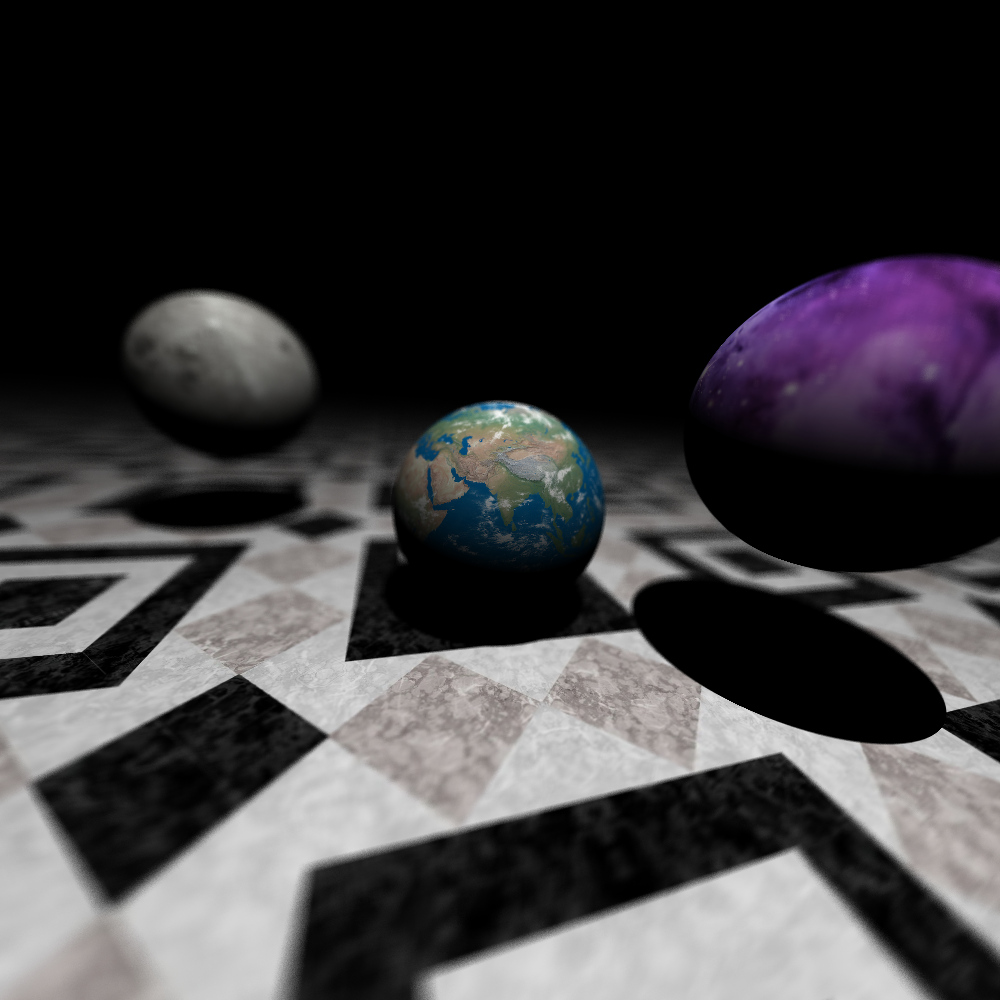

# Luz 💡

A simple python3 raytracer using MPI that renders to ASCII, suitable as a cluster test tool.





#### Requires:
  - PIL
  - numpy
  - pandas
  - py4mpi
  - argparse


#### Implements:

  - hard shadows
  - reflections
  - Lambert shading
  - Phong-Blinn shading
  - spheres (texture mapped)
  - planes(texture mapped)
  - triangles (color interpolated between vertices)
  - spherical skyboxes
  - arbitrary camera positioning and orientation
  - json scene files
  - depth of field (sloooooow)


#### Usage:

`mpirun -np 5 --oversubscribe python3 luz.py`

````
usage: luz.py [-h] [--bounces BOUNCES] [--height HEIGHT] [--width WIDTH] [--cols COLS] [--sd SD] [--output OUTPUT] [--scene SCENE] [--stats] [--long] [--camera CAMERA [CAMERA ...]]
              [--target TARGET [TARGET ...]] [--focal FOCAL] [--aperture APERTURE] [--samples SAMPLES] [--profile]

A simple MPI raytracer.

optional arguments:
  -h, --help            show this help message and exit
  --bounces BOUNCES     max number of bounces
  --height HEIGHT       output image height
  --width WIDTH         output image width
  --cols COLS           terminal columns for ascii output
  --sd SD               number of standard deviations from the mean to consider a node an outlier
  --output OUTPUT       output image filename
  --scene SCENE         json scene file
  --stats               show stats on computational distribution
  --long                show long stats on computational distribution
  --camera CAMERA [CAMERA ...]
                        camera origin
  --target TARGET [TARGET ...]
                        camera target
  --focal FOCAL         camera focal length
  --aperture APERTURE   camera aperture
  --samples SAMPLES     dof samples
  --profile             runs profiler
````

#### Todo:

  - soft shadows (https://stackoverflow.com/questions/31709332/ray-tracing-soft-shadow)
  - oct-tree object storage
  - texture mapping triangles
  - named materials
  - animation path with points and interpolation in between
  - triangle per vertex normals with interpolation
  - refraction (https://www.scratchapixel.com/lessons/3d-basic-rendering/introduction-to-shading/reflection-refraction-fresnel, https://graphics.stanford.edu/courses/cs148-10-summer/docs/2006--degreve--reflection_refraction.pdf, https://blog.demofox.org/2017/01/09/raytracing-reflection-refraction-fresnel-total-internal-reflection-and-beers-law/)
  - other shapes (https://www.scratchapixel.com/lessons/3d-basic-rendering/minimal-ray-tracer-rendering-simple-shapes/ray-sphere-intersection)
  - antialiasing
  - loading standard models
  - bokeh shapes (circular, hex)
  - global illumination (pathtracing? photon mapping?)
  - depth adaptive sampling, where the z buffer determines how many samples are shot for that pixel after the initial +0,+0 primary ray is shot
  - shadow calculations assume all objects are solid... :(
